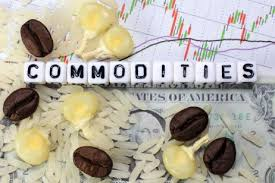

# Market-ticker-prediction
First ML project about the market ticker recognition. Project for ML-zoomcamp course



---

## 1 - Problem description

A futures market is an auction market in which participants buy and sell commodities and futures contracts for delivery on a specified future date. Futures are exchange-traded derivative contracts that lock in future delivery of a commodity or security at a price set today.

Usually investors try to predict the future movement of the price into the market using metrics and indicators based on historical data, but the prediction isn't enough to develop a successful trading strategy. You can't focus only in the historical price, but you should consider a lot of things like the time and how long they eant to keep the trade. 

A lot of strategies are using trading guidelines and operators such as measure of risk as stop loss and take profit, however, there is a field growing in this sector established on statistical decision based on probabilities.

With this project I tried to process the data, trying to predict the market ticker. A key aspect of this repository is that it is not intended as a strategy, as it does not have the necessary components to enter and exit a position, as well as having no risk management. If this project works it is because each market has its own values, different from each other.

---
## 2 - The Goal: The target of this project is to recognize which market the data belongs to (for processed data, see the next step)
--- 

## 3 - Data
This dataset offers detailed and up-to-date information on precious metals futures. Futures are financial contracts obligating the buyer to purchase, and the seller to sell, a particular precious metal (such as gold, silver, platinum, etc.) at a predetermined future date and price.

The data was obtained from this repository (https://www.kaggle.com/datasets/guillemservera/precious-metals-data) that has data, from 2000 until october 2023, on different markets:
	- Gold 
	- Silver
	- Platinum
    	- Copper
    	- Palladium

Important details about the data:
- The timezone is UTC
- The data updates daily
- The format of the data is: 
	- Date: The date the data was recorded. Format YYYY-MM-DD.
	- Open: Market opening price.
	- High: Highest price during the trading day.
	- Low: Lowest price during the trading day.
	- Close: Market closing price.
	- Volume: Number of contracts traded during the day.
	- Ticker: Market quotation symbol for the future.
	- Commodity: Name of the precious metal the future refers to.
 
In this dataset we decided to use the dataset with different commodities, in this way we do not have data relating to the single market. I uploaded the entire dataset to the repository. File: *all_commodities_data.csv*
The latest datastore in the data folder to train our model was obtained on October 20, 2023
 
This data is processed using the ``train.py`` file archive in the data folder.
These markets have different prices and flows, so I decided to process the data into something common between them, such as distances between the main important values:
	- 'diff_oc': This is the distance between the open and the close of the day 
    	- 'diff_ol': This is the distance between the open and the low of the day 
    	- 'diff_oh': This is the distance between the open and the high of the day 
    	- 'diff_cl': This is the distance between the close and the low of the day 
    	- 'diff_ch': This is the distance between the close and the high of the day
    	- 'diff_hl': This is the distance between the high and the low of the day 

We decided to delete some columns based on the heatmap of the correlation matrix, because with this matrix we showed the dependencies between the columns.
We cut:
	- ticker, because it's the same of commodity, but wrote under another form.
	- volume
	- open
	- high
	- low

---

## 4 - Structure of the repository

### DATASET
**all_commodities_data.csv**: Contains the full dataset
**Copper_data.csv**: Dataset to test the model and discover all the copper values
**Gold_data.csv**: Dataset to test the model and discover all the gold values
**Silver_data.csv**: Dataset to test the model and discover all the silver values
**Palladium_data.csv**: Dataset to test the model and discover all the palladium values
**Platinum_data.csv**: Dataset to test the model and discover all the platinum values

### Files
**MidTermProj.ipynb**: contains the notebook to explore the data and choose the model with the best results
**Pipfile and Pipfile.lock**: contains the dependencies to run the repo
**predict.py**: Contains the prediction using flask
**predict-test.py**: Contains some values to test the model
**mid_term_model.bin**: This is the model got from the train.py using Pickle
**train.py**: Contains the model with the best performance in the testing set, obtained using the notebook
**Dockerfile**: contains the image for the docker

---

## 5 - Loading final model in web service:

#### pipenv

The script *train.py* load the model : *mid_term_model.bin* and it can run in a separate virtual environment across its dependency files *Pipenv* and *Pipenv.lock*.
*flask* was used for the local web deployment in *train.py* script.

- Install pipenv :
```
pip install pipenv
```
- Get a copy of project and dependencies, or clone the repository :
```
git clone [https://github.com/bergimax/Market-ticker-prediction]
```
- From the project's folder, run :
``` 
pipenv install
```
- All the dependencies should be automatically soddisfied, just verify.
- Run the web service using gunicorn inside the virtual environment:
```
pipenv run gunicorn --bind 0.0.0.0:9696 predict:app
```

#### Docker
There is also the file: *Dockerfile* in the repository, through this you can run the web service in a completely separate container :
- From the project directory, create the docker image :
```
docker build -t market_pred .
```
- Run the docker image created:
```
docker run -it --rm -p 9696:9696 market_pred:latest
```

#### Test the local web service:

- To test the local web service, you can run the test script in another terminal:
```
python predict-test.py
```
- If you edit the market values to analize some data, you should modify the parameters in the file predict-test.py, maybe you cane take them from the smaller dataset present in this repo of each market:
```
vi predict-test.py
```
P.S: The current values in predict-test.py are taken from Gold dataset, raw number 5000.

---

#### Video of the service running :
I loaded a small video where you can see how the web service works : *docker_running.mp4* 

The video show the local web service starting in Docker and how it respond to the predict-test.py
I also attached the screenshot of the service running with flask and gunicorn, the files are: *gunicorn_running.png* and *Flask_running.png*
